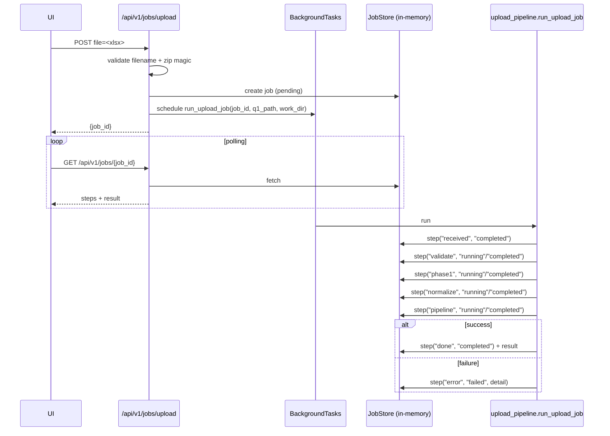

# Upload workflow

The upload pipeline converts an analyst-uploaded `.xlsx` into a viability
report without blocking the HTTP request. The route returns immediately
with a `job_id`, and the UI polls for progress.

## Route

`POST /api/v1/jobs/upload` in
[code/backend/api/routes/upload_jobs.py](../../backend/api/routes/upload_jobs.py).

## Request shape

Multipart body with a single field `file`. The filename must end in
`.xlsx` (case-insensitive) and the content must start with the OOXML zip
magic bytes (`50 4B 03 04`).

```bash
curl -X POST http://127.0.0.1:8000/api/v1/jobs/upload \
  -H "X-Role: analyst" \
  -F "file=@code/inputs/Q1 Daily Metrics 2026.xlsx"
```

Response:

```json
{"success": true, "data": {"job_id": "fac4e4ef-..."}, "error": null}
```

## Polling

`GET /api/v1/jobs/{job_id}` returns the full record:

```json
{
  "success": true,
  "data": {
    "job_id": "fac4e4ef-...",
    "status": "running",
    "steps": [
      {"id": "received", "label": "Received upload", "status": "completed", "detail": "Q1_upload.xlsx"},
      {"id": "validate", "label": "Validating workbook sheets", "status": "completed"},
      {"id": "phase1", "label": "Phase-1 extraction (canonical CSVs)", "status": "running"}
    ]
  }
}
```

When `status == "done"` the `result` field carries the same shape that
`/api/v1/viability/evaluate` returns. When `status == "error"` the
`error` step carries the detail.

## Lifecycle



## Step IDs

| Step | What it does |
|---|---|
| `received` | Marks the upload accepted and stages the file under a tmp work_dir. |
| `validate` | Opens the workbook and checks expected sheet names. |
| `phase1` | Calls `scripts.build_phase1_canonical_base` on the uploaded workbook + bundled template + bundled example. Writes CSVs into the work_dir. |
| `normalize` | Maps phase-1 CSVs to the engine input schema. |
| `pipeline` | Runs `engine.pipeline.Pipeline().run()` plus the ML inference and stamps the result. |
| `done` | Terminal success. |
| `error` | Terminal failure; carries the exception text. |

## Temporary directory layout

Each job runs inside a `tempfile.mkdtemp()` directory:

```
<tmpdir>/
  Q1_upload.xlsx         <- uploaded file
  phase1/                <- phase-1 CSVs for this upload only
  job_log.json           <- structured step log
```

After completion (success or failure) the work_dir is cleaned up by
`cleanup_work_dir`, so nothing the user uploaded persists on disk.

## Why background tasks + in-memory store

- Uploads cannot block the request: phase-1 takes multiple seconds on
  the provided workbooks.
- Analyst-scale usage (one or two concurrent uploads) does not justify
  Celery/Redis yet. An in-memory `JobStore` is enough.
- For production, swap the store implementation behind the same
  interface. The route file does not care how the store is backed.

## Security notes

- The route requires role `analyst` and is rate-limited.
- The filename check is lowercase-anchored; suffix tricks like
  `malicious.xlsx.js` get rejected.
- The zip-magic check prevents forged content-types.
- `MAX_UPLOAD_BYTES` (defined in
  [api/upload_pipeline.py](../../backend/api/upload_pipeline.py)) caps
  payload size.

## Role escalation

The pipeline always runs with whatever role the request carried - we
never escalate to `admin` inside the background task. If the pipeline
needs to touch admin-only data in the future, add an explicit check at
the top of `run_upload_job`.
