# Folder contract: `code/inputs`, `code/intermediates`, `code/outputs`

All pipeline data lives under three sibling directories inside `code/`. Every
script and notebook resolves its paths via
[code/lib/repo_paths.py](../../lib/repo_paths.py) so the contract is enforced
in code, not just in docs.

```mermaid
flowchart LR
    subgraph inputs[code/inputs/]
      A1[[Q1 Daily Metrics 2026.xlsx]]
      A2[[RideYourWay_Prospective_Market_Intake_Template.xlsx]]
      A3[[RideYourWay_Prospective_Market_Intake_Example.xlsx]]
    end
    subgraph intermediates[code/intermediates/]
      B1[phase1/*.csv + *.json]
      B2[training/readiness_training_rows.csv]
      B3[inference_inputs/<br/>phase1 snapshot + training base + MANIFEST]
    end
    subgraph outputs[code/outputs/]
      C1[models/xgboost_readiness_*]
      C2[reports/stage1 .. stage3 + phase3_eda]
      C3[plots/stage1 .. stage3]
    end
    inputs --> intermediates --> outputs
```



## Rules

1. **`code/inputs/` holds only `.xlsx` source workbooks.** Nothing else writes
   there. The README in
   [code/inputs/README.md](../../inputs/README.md) enumerates the three
   expected files.
2. **`code/intermediates/` holds script outputs that feed the next script.**
   Nothing here is user-facing. Everything is either CSV or JSON with
   explicit provenance fields.
3. **`code/outputs/` is the canonical write target for everything consumers
   look at.** Trained models (`outputs/models/`), stage reports
   (`outputs/reports/stage{1,2,3}/`), plots (`outputs/plots/stage{1,2,3}/`),
   and the phase-3 EDA (`outputs/reports/phase3_eda/`).
4. **Scripts always take `code_root_from_anchor()`** as their root and
   resolve inputs/intermediates/outputs relative to that. See
   [code/lib/repo_paths.py](../../lib/repo_paths.py) `code_root_from_anchor`.
5. **Paths written into metadata (JSON, CSV) are always repo-relative**, e.g.
   `code/intermediates/phase1/...`, never absolute. This is why the stage-3
   notebook explicitly writes the relative path for
   `metadata.training_data.path` and `model_card.interpretation_artifact`.
6. **The Docker image mirrors the same contract under `/workspace/code/`**
   (see [backend/Dockerfile](../../backend/Dockerfile)) so the upload pipeline
   scripts find their inputs/intermediates without code changes.

## Why everything lives under `code/`

Early drafts placed `inputs/`, `intermediates/`, `outputs/` at the repo root.
That made the repo visually tidy but created two real problems:

- **The git repo lives in `code/`**, not at the repo root. Putting data
  outside `code/` meant it was not tracked by git at all, so diffs,
  regenerations, and PR previews had no history.
- **Docker build context** starts at the repo root but the image only needs
  `code/`. Having artifact folders outside `code/` forced the Dockerfile to
  `COPY` two disjoint subtrees; unifying them under `code/` lets the backend
  image cleanly copy one tree.

Decision recorded in
[decision-records/0003-code-folder-reorg.md](../decision-records/0003-code-folder-reorg.md).

## How to reproduce

```bash
# From repo root
cd code
source .venv/bin/activate

# 1. Extract intake workbooks -> canonical base
python scripts/build_phase1_canonical_base.py

# 2. Generate synthetic training rows
python scripts/generate_readiness_training_rows.py

# 3. Join + label training base (uses gate rules in config)
python scripts/build_readiness_training_base.py

# 4. Snapshot phase-1 into inference_inputs/ (adds manifests)
python inference_engine/scripts/sync_inputs_from_phase1.py

# 5. Train and export the model
python inference_engine/scripts/train_readiness_model_from_inputs.py

# 6. Optional: run stage notebooks for reports/plots
jupyter nbconvert --to notebook --execute \
    inference_engine/notebooks/stages/stage1_eda_inference.ipynb \
    inference_engine/notebooks/stages/stage2_modeling_diagnostics.ipynb \
    inference_engine/notebooks/stages/stage3_export_backend_model.ipynb
```

After a successful run `git status` should only report diffs under
`code/intermediates/` and `code/outputs/`. Diffs under `code/inputs/`
indicate someone edited a source workbook.

## Forbidden operations

- Writing user-facing output into `code/intermediates/`.
- Writing a generated artifact into `code/inputs/`.
- Hardcoding `/Users/...` or `/home/...` paths into any JSON, CSV, or
  notebook. If you see an absolute path, scrub it to a `code/`-prefixed
  relative path (the stage-3 notebook already has guards for the two spots
  that used to regress).
