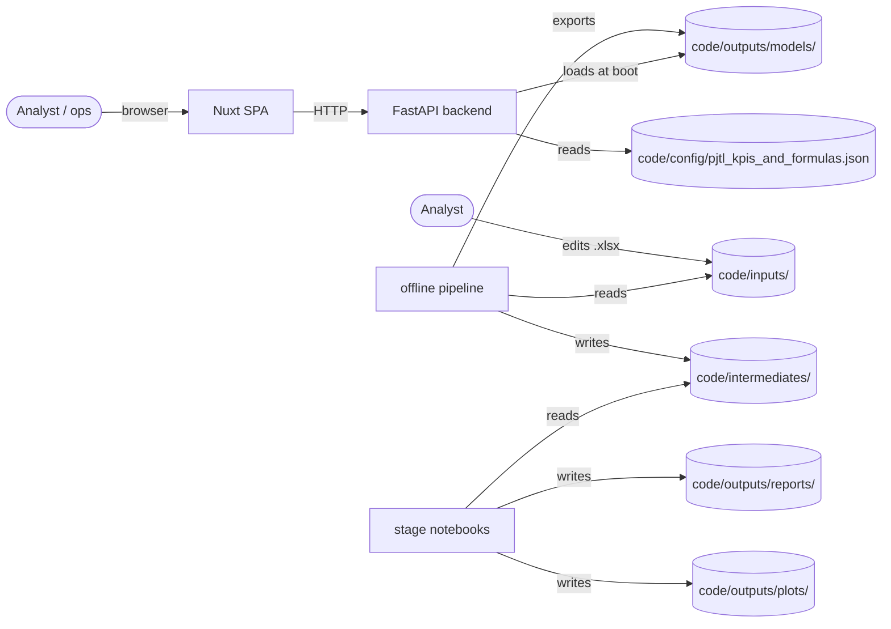

# High-level design

## Purpose

The PJTL x Ride YourWay workspace evaluates whether a **prospective NEMT
market** meets the operational and economic gates required to launch
service, and explains the answer to three audiences:

- **Analysts** who maintain the intake workbooks.
- **Operations and finance leads** who negotiate contracts.
- **Executives** who make launch/no-launch decisions.

## System boundary

The system boundary is explicit: the backend never reaches out to a database
or a third-party API at request time. All model+KPI state is baked into the
image. This is by design for a pre-launch decision-support tool: results
must be reproducible, and an internet outage must not block a readiness
call.

## Data pipeline (offline)

1. Three xlsx workbooks under `code/inputs/` are the single source of truth
   for ground data:
   - `Q1 Daily Metrics 2026.xlsx` - frozen historical operating metrics.
   - `RideYourWay_Prospective_Market_Intake_Template.xlsx` - blank intake.
   - `RideYourWay_Prospective_Market_Intake_Example.xlsx` - worked example.
2. `code/scripts/build_phase1_canonical_base.py` extracts audited sheets
   into CSVs plus JSON field dictionaries under
   `code/intermediates/phase1/`.
3. `code/scripts/generate_readiness_training_rows.py` emits a mix of
   bulk, boundary-dense, and decision-flip rows under
   `code/intermediates/training/readiness_training_rows.csv`.
4. `code/scripts/build_readiness_training_base.py` joins those rows with
   phase-1 stats, labels each row via the gate rules in the KPI config, and
   writes
   `code/intermediates/inference_inputs/readiness_training_base.csv` with
   `label_ready in {0,1}`.
5. `code/inference_engine/scripts/sync_inputs_from_phase1.py` creates a
   frozen snapshot under `code/intermediates/inference_inputs/` with
   `MANIFEST.json` and `MANIFEST.upstream.json` so notebooks and training
   runs are deterministic.
6. `code/inference_engine/scripts/train_readiness_model_from_inputs.py`
   fits an `XGBClassifier`, calibrates it, and exports model + metadata to
   `code/outputs/models/xgboost_readiness_*`.
7. `inference_engine/notebooks/stages/stage{1,2,3}*.ipynb` produce EDA,
   modeling diagnostics, and the final exported model card to
   `code/outputs/reports/` and `code/outputs/plots/`.

## Runtime stack

- **FastAPI** + `pydantic-settings` + `slowapi` rate limiting.
- **XGBoost 2.x** with `joblib`-serialized model + JSON metadata.
- **Nuxt 3** + Nitro (server routes for the backend proxy).
- **Docker Compose** for local orchestration.
- **Python 3.12** on slim Debian for the backend image; Node 22 Alpine for
  the frontend image.

## Readiness decision surface

There are three layers of decision logic. The UI surfaces all three so that
analysts can see why a market was classified the way it was.

1. **Nine binary gates** from
   [code/config/pjtl_kpis_and_formulas.json](../../config/pjtl_kpis_and_formulas.json)
   (see [kpi/gate-logic.md](../kpi/gate-logic.md)).
2. **Readiness classifier** - an XGBoost model trained on synthetic
   gate-rule-labeled rows so that its decision boundary matches the gates
   but smooths out the "one-gate-barely-fails" brittleness.
3. **Tier policy** from
   [code/backend/engine/evaluation/confidence.py](../../backend/engine/evaluation/confidence.py)
   that downgrades the tier to "Assumption-Backed" when a gate's source
   formula is unresolved (see [kpi/tier-policy.md](../kpi/tier-policy.md)).

## Non-functional qualities

- **Reproducibility**: every intermediate has a `MANIFEST.json` recording
  the SHA-256 of the input. The model's `xgboost_readiness_metadata.json`
  includes the training data path and expected feature order.
- **Observability**: the backend emits structured logs with a `request_id`
  per request (see
  [middleware/request_context.py](../../backend/api/middleware/request_context.py)).
- **Security posture**: header-auth is explicitly flagged as demo-only. A
  startup warning is logged if `RYW_ENV=production` is combined with
  `RYW_AUTH_MODE=header` (see [ops/security-todos.md](../ops/security-todos.md)).
- **Rate limiting**: `/viability/evaluate` is capped at 60/min per IP and
  `/inference/predict` at 120/min per IP via `slowapi`.
- **Testability**: the sensitivity harness
  [test_readiness_edge_cases.py](../../inference_engine/scripts/test_readiness_edge_cases.py)
  validates the "1% flip" property on every build.

## Trade-offs

- **Synthetic training rows** vs a real labeled dataset. We do not yet have
  enough real markets to train on. The synthetic ruleset-labeled data
  enforces that the model's decisions track the gates; when real data
  exists, the same script pipeline can ingest it (see
  [ml/training.md](../ml/training.md) "migration path").
- **In-memory job store** vs persistence. The upload pipeline stores job
  status in a process-local dict
  ([api/jobs_store.py](../../backend/api/jobs_store.py)). That is fine for
  analyst-scale usage (one user, < 50 jobs/day). A production system should
  swap it for Redis or Postgres.
- **`X-Role` header auth** vs JWT. Demo-grade so that reviewers can switch
  role from the UI. The code path for JWT exists and is selectable via
  `RYW_AUTH_MODE=jwt`; the migration is documented in
  [api/roles-and-auth.md](../api/roles-and-auth.md).
