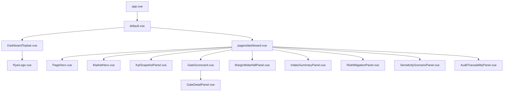

# SPA layout

The frontend is a Nuxt 3 single-page application. Every route shares the
same visible chrome, so navigation is instant and stateless transitions do
not re-render the topbar, hero, or breadcrumb.

## Layout tree

```
code/frontend/
  layouts/
    default.vue            <- wraps every page
  pages/
    index.vue              <- "/" landing
    market.vue             <- "/market" intake + evaluation form
    dashboard.vue          <- "/dashboard" main readiness dashboard (tabs)
    audit.vue              <- "/audit" audit trail + traceability
    settings.vue           <- "/settings" role + preferences
  components/
    DashboardTopbar.vue    <- global topbar (logo + tabs + role + theme)
    PageHero.vue           <- per-page hero title/subtitle
    MarketHero.vue         <- market-context hero (status pill + KPI strip)
    RywLogo.vue            <- SVG logo used in topbar and landing
    ...                    <- panels, pills, microcharts
```

## `layouts/default.vue`

Responsibilities:

- Mount `DashboardTopbar` once.
- Render `<slot />` inside a `<main>` with the maize-blue background token.
- Attach the `data-theme` attribute to `<html>` driven by `useAppTheme()`.
- Apply the global compact spacing and typography.

Because the layout is shared, **`DashboardTopbar` only mounts once** across
the whole session. Switching between `/dashboard` and `/audit` does not
remount the logo, role switcher, or theme toggle, which keeps the UI feeling
like an app rather than a set of pages.

## Shared state

The SPA reads and writes a small amount of cross-page state via composables:

- [composables/useBackendApi.ts](../../frontend/composables/useBackendApi.ts)
  exposes a reactive `role` ref plus the `apiGet()`, `apiPost()`, `apiUpload()`
  helpers. Every page uses the same `role` so changing it in
  `DashboardTopbar` immediately changes the header on every outgoing request.
- [composables/useViabilitySession.ts](../../frontend/composables/useViabilitySession.ts)
  stores the current market profile and the most recent evaluation in
  `sessionStorage` under the keys `RYW_STORAGE_MARKET` and
  `RYW_STORAGE_HISTORICAL`. Switching pages never drops the evaluation.
- [composables/useAppTheme.ts](../../frontend/composables/useAppTheme.ts)
  toggles `html[data-theme="light" | "dark"]` and persists the choice.

## Why a single layout

Earlier iterations had per-page headers and each page imported its own copy
of the topbar. That created three problems:

1. The role switcher lived on multiple pages and got out of sync unless the
   user reloaded.
2. Small copy changes (e.g., the brand tagline) required edits in four
   places.
3. Page transitions flickered because Nuxt remounted the chrome on every
   navigation.

Consolidating the chrome into `layouts/default.vue` fixed all three. The
decision is captured in
[decision-records/0001-spa-architecture.md](../decision-records/0001-spa-architecture.md).

## Component tree at runtime



See [frontend/component-catalog.md](../frontend/component-catalog.md) for the
per-component contract.
