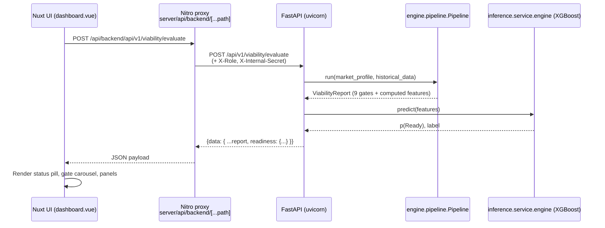

# System overview

Ride YourWay's launch-readiness workspace is a **single-repo, two-service web
application plus an offline analytics pipeline**. Every runtime and batch
process (including [code/docker-compose.yml](../../docker-compose.yml)) lives
under [`code/`](../../); the containing directory only carries planning
artifacts (`Dashboard/`, NDAs, the PJTL deliverable bundle).

## Components

### Backend: FastAPI (`code/backend/`)
- **ASGI entrypoint**: [code/backend/api/main.py](../../backend/api/main.py)
  exposes `app` for `uvicorn api.main:app`.
- **Application wiring**: [code/backend/api/app.py](../../backend/api/app.py)
  assembles middleware (CORS, rate limiting via `slowapi`, internal-secret
  enforcement, structured request context) and mounts every router.
- **Routes** (all under `/api/v1` except health):
  - [routes/health.py](../../backend/api/routes/health.py) - `/health`,
    `/ready`
  - [routes/viability.py](../../backend/api/routes/viability.py) -
    `/api/v1/viability/evaluate`
  - [routes/inference_routes.py](../../backend/api/routes/inference_routes.py)
    - `/api/v1/inference/meta`, `/api/v1/inference/predict`
  - [routes/kpis.py](../../backend/api/routes/kpis.py) - `/api/v1/kpis`
  - [routes/upload_jobs.py](../../backend/api/routes/upload_jobs.py) -
    `/api/v1/jobs/upload`, `/api/v1/jobs/{job_id}`
  - [routes/metrics_admin.py](../../backend/api/routes/metrics_admin.py) -
    `/api/v1/admin/metrics`
  - [routes/operations_demo.py](../../backend/api/routes/operations_demo.py)
    - CRUD fixtures for the Operations UX demo (disabled via
    `RYW_ENABLE_OPERATIONS_DEMO`).
- **Core domain modules**:
  - [engine/](../../backend/engine/) - viability pipeline, dashboard
    formatting, readiness classification, Kent-Leg math, input-layer
    ingestion.
  - [inference/](../../backend/inference/) - XGBoost model loading and
    explainable prediction wrapper.
- **Settings**: [api/config.py](../../backend/api/config.py) reads `RYW_*`
  environment variables through pydantic-settings.

### Frontend: Nuxt 3 SPA (`code/frontend/`)
- Runs on Node 22 (see [Dockerfile](../../frontend/Dockerfile)).
- Single shared layout at
  [layouts/default.vue](../../frontend/layouts/default.vue) hosts the global
  `DashboardTopbar`, `PageHero`, and breadcrumb.
- Pages: [index.vue](../../frontend/pages/index.vue),
  [market.vue](../../frontend/pages/market.vue),
  [dashboard.vue](../../frontend/pages/dashboard.vue),
  [audit.vue](../../frontend/pages/audit.vue),
  [settings.vue](../../frontend/pages/settings.vue).
- All backend calls flow through
  [server/api/backend/[...path].ts](../../frontend/server/api/backend/%5B...path%5D.ts),
  a Nitro proxy that strips the `/api/backend` prefix and forwards to
  `NUXT_BACKEND_BASE_URL` with the optional `X-Internal-Secret` header.
- Shared state lives in composables:
  - [composables/useBackendApi.ts](../../frontend/composables/useBackendApi.ts)
    - fetch helpers and the reactive `role` used by every page.
  - [composables/useAppTheme.ts](../../frontend/composables/useAppTheme.ts) -
    light/dark toggle.
  - [composables/useViabilitySession.ts](../../frontend/composables/useViabilitySession.ts)
    - client-side storage of the active market evaluation.

### Offline data pipeline (`code/scripts/`, `code/inference_engine/`)
See [data-pipeline/overview.md](../data-pipeline/overview.md). Briefly:

1. Analyst places the three `.xlsx` workbooks under
   [code/inputs/](../../inputs/).
2. `build_phase1_canonical_base.py` writes audited CSVs to
   `code/intermediates/` (phase artifacts are regenerable and may be pruned).
3. `generate_readiness_training_rows.py` writes training rows to
   `code/intermediates/` (training artifacts are regenerable and may be pruned).
4. `build_readiness_training_base.py` joins them and labels each row to
   [code/intermediates/inference_inputs/readiness_training_base.csv](../../intermediates/inference_inputs/).
5. `sync_inputs_from_phase1.py` snapshots the inputs with manifests.
6. `train_readiness_model_from_inputs.py` exports the model to
   [code/outputs/models/](../../outputs/models/).
7. Inference scripts can regenerate analytics reports/plots when needed.

## Request flow (browser -> verdict)

## Deploy topology

### Local / demo
[code/docker-compose.yml](../../docker-compose.yml) declares two services:

- `backend` (built from [code/backend/Dockerfile](../../backend/Dockerfile),
  exposes `8000:8000`).
- `frontend` (built from [code/frontend/Dockerfile](../../frontend/Dockerfile),
  exposes `${RYW_FRONTEND_PORT:-3010}:3000`).

The backend's `/ready` endpoint validates that the XGBoost model is loadable;
the frontend `depends_on` it as `service_healthy`.

### Production guidance
- Put a reverse proxy (nginx, Cloudflare, ALB) in front of both services.
- Set `RYW_AUTH_MODE=jwt` and supply `RYW_JWT_SECRET`.
- Set `RYW_INTERNAL_API_SECRET` so the proxy path is the only way to reach
  the API, mirrored in `NUXT_INTERNAL_API_SECRET` on the frontend.
- Set `RYW_CORS_ORIGINS` to the deployed frontend origin(s).
- Keep `RYW_EXPOSE_INTERNAL_ERRORS=false`.
- Disable the operations demo router (`RYW_ENABLE_OPERATIONS_DEMO=false`)
  if you do not want the in-memory CRUD surface.

See [ops/security-todos.md](../ops/security-todos.md) and
[production-checklist.md](../production-checklist.md).

## Design intent

- **Monorepo**: backend + frontend + pipeline + configs + notebooks all
  version-controlled together so a single commit can change a gate threshold,
  the script that reads it, the API that serves it, and the UI that renders
  it. This matters because readiness rules are the product.
- **Contract at `code/config/pjtl_kpis_and_formulas.json`**: Python, notebook,
  and UI paths all resolve the same document so the nine gates are defined
  exactly once.
- **No network calls during inference**: the model is a file artifact under
  `code/outputs/models/` loaded at process start. Evaluating a market is
  purely deterministic compute on in-memory data.
- **Repo root marker**: the backend walks up from `/app` to find `code/config/`.
  In the Docker image we stage a synthetic tree at `/workspace` and set
  `RYW_REPO_ROOT=/workspace` so the phase-1 scripts resolve unchanged.
