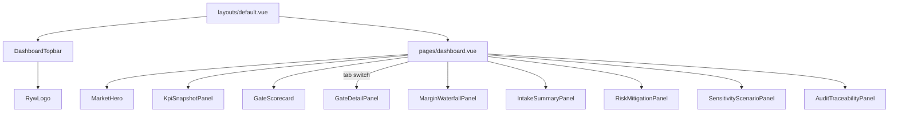

# Component catalog

Every Vue component in
[code/frontend/components/](../../frontend/components/) with its purpose,
props, and where it is mounted. Components are listed alphabetically;
panels and widgets are grouped by role at the end.

## Chrome and navigation

### `DashboardTopbar.vue`
Global topbar mounted by `layouts/default.vue`. Renders the `RywLogo`,
the primary tab row (Home / Market / Dashboard / Audit / Settings), the
role switcher (analyst / ops / admin), and the theme toggle. Role
changes write through `useBackendApi().role` so every subsequent API
call uses the new header.

### `PageHero.vue`
Simple hero used by every non-dashboard page. Props: `title`,
`subtitle`, optional `badge`, optional `icon` slot. Produces the
maize-highlighted page header strip.

### `MarketHero.vue`
Market-context hero used on `dashboard.vue`. Renders the market name,
city/state, corridor, and the primary readiness `StatusPill`. Props:
`market`, `readiness`.

### `RywLogo.vue`
Inline SVG Ride YourWay logo. Accepts a `variant` prop
(`full` / `mark`) so the topbar can show just the mark on narrow
screens.

## Panels (large composable blocks)

### `KpiSnapshotPanel.vue`
Top panel on the dashboard. Renders the weekly operating snapshot with a
week tag ("Week of Apr 13 - Apr 19, 2026") and the nine feature values
laid out as `RingStat` (percentages) / `BarStat` (numeric) microcharts.
Each row carries an `InfoTip` explaining its business meaning. Data
comes from `dashboardData.ts` via `useBackendApi`.

### `GateScorecard.vue`
The readiness gate carousel. Each slide is a single gate card. Cards
emit `@select` to switch the dashboard into the "Gate detail" tab
(rendered by `GateDetailPanel.vue`). Shows the `StatusPill`, the
feature value, the threshold, and the source phrase. No "1/9 2/9"
counters - the carousel dot indicator does that job visually.

### `GateDetailPanel.vue`
Secondary tab that opens when a gate card is selected. Deep-dive view
for a single gate: value, threshold, pass rule, formula, source, and
a bar visualization of the distance from threshold.

### `MarginWaterfallPanel.vue`
Redesigned cost-vs-revenue waterfall. Tiles plus horizontal bars show
revenue, cost ceiling, projected cost, and net margin. Uses the
`BarStat` microchart for each line.

### `IntakeSummaryPanel.vue`
Plain-English summary of the uploaded intake: how many programs, what
modes are covered, how many weekly Kent-Legs, and the one-line takeaway
("Concentration-heavy intake. Top program carries 34% of weekly
volume."). Designed so a non-analyst reader can tell why the market
scored what it scored.

### `CapacitySchedulingPanel.vue`
Two-column summary of fleet sizing and scheduling cadence. Props pulled
from the viability report's `fleet` block.

### `CostRevenueSummaryPanel.vue`
Tiled summary of projected weekly revenue, cost, operating margin, and
revenue per Kent-Leg. Accompanies the margin waterfall.

### `DemandContractSummaryPanel.vue`
Summary of prospective contracts in the intake (count, weighted volume
share, concentration).

### `SensitivityScenarioPanel.vue`
Accordion container. Each child row is a what-if scenario with a
slider, the derived feature value, and the resulting `p(Ready)` delta.
Pulls `source` labels from `dashboardData.ts` assumptions so values are
never hard-coded in the template.

### `RiskMitigationPanel.vue`
Accordion container of risk/action items. Each row has an owner, a
title, a detail paragraph, a due date, and a status badge.

### `AuditTraceabilityPanel.vue`
Accordion container that links each computed feature back to its source
CSV under `code/intermediates/phase1/`. Renders `lineage_refs` from the
viability report.

## Microcharts

### `RingStat.vue`
Circular progress ring used for percentage values. Props: `value`,
`label`, `threshold`, `tone` (`pass` / `provisional` / `fail`).

### `BarStat.vue`
Horizontal bar for numeric values. Props: `value`, `max`, `label`,
`threshold`, `tone`. Draws a threshold marker so the eye can tell where
pass/fail falls.

### `BarList.vue`
List of `BarStat` bars. Used for mode mix and contract concentration
breakdown.

### `MetricCard.vue`
Generic rectangular metric card with label, value, optional delta,
optional footnote. Used by panels that need a simple tile.

## Atoms and utility

### `StatusPill.vue`
Colored pill with embedded SVG icon. Three tones (`pass`,
`provisional`, `fail`). Props: `status`, `size` (`sm` / `md` / `lg`).
Uses the `--amber-ink` CSS token for provisional text.

### `InfoTip.vue`
Circled-i tooltip component. Props: `title`, `body`. Accessible via
keyboard. The body accepts markdown-lite (links and code spans).

### `CollapsibleCard.vue`
Accordion wrapper. Props: `title`, `badge`, `defaultOpen`. Emits
`@toggle` so parent panels can persist which section is expanded.

## Component contracts at a glance

