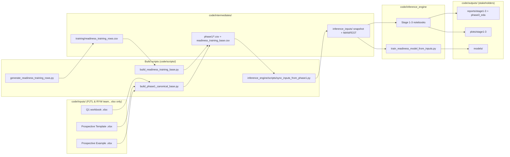
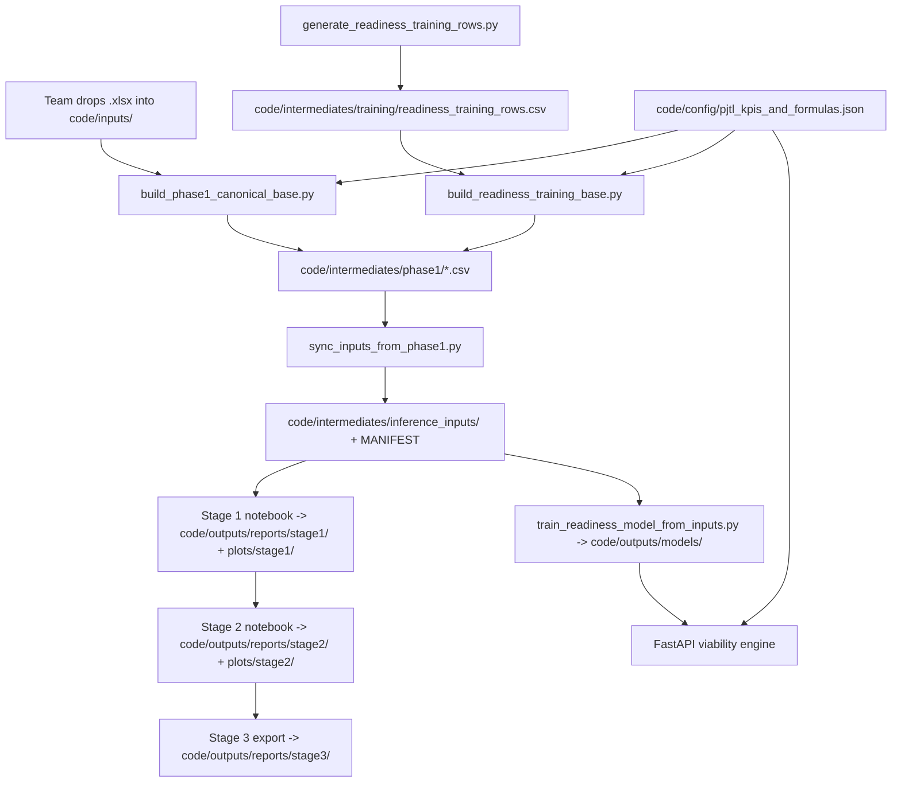

# PJTL / Ride YourWay — data flow and control flow

How team files move through the repository into stakeholder outputs. The
folder contract is **`code/inputs/` = .xlsx**, **`code/intermediates/` = CSV / JSON**,
**`code/outputs/` = models + plots + reports**.

## Data flow



**Legend**

| Location | Role |
| --- | --- |
| `code/inputs/` | Team-supplied workbooks (.xlsx only). |
| `code/intermediates/phase1/` | Canonical base tables + audits extracted from `code/inputs/`. |
| `code/intermediates/training/` | Sampled ML training rows (before labeling). |
| `code/intermediates/inference_inputs/` | Flat snapshot of `phase1/` + MANIFEST, used by notebooks and the training script. |
| `code/outputs/models/` | Exported XGBoost model + metadata. The backend Docker image stages these into `/app/inference_models`. |
| `code/outputs/reports/` | Stage-1-3 diagnostics, model card, interpretation notes, phase-3 EDA. |
| `code/outputs/plots/` | Notebook figures. |

## Control flow



**Commands (repo root)**

```bash
python code/scripts/build_phase1_canonical_base.py
python code/scripts/generate_readiness_training_rows.py
python code/scripts/build_readiness_training_base.py
python code/inference_engine/scripts/sync_inputs_from_phase1.py
python code/inference_engine/scripts/train_readiness_model_from_inputs.py
# Optional: re-run the Stage 1-3 notebooks to refresh code/outputs/reports + plots.
```
